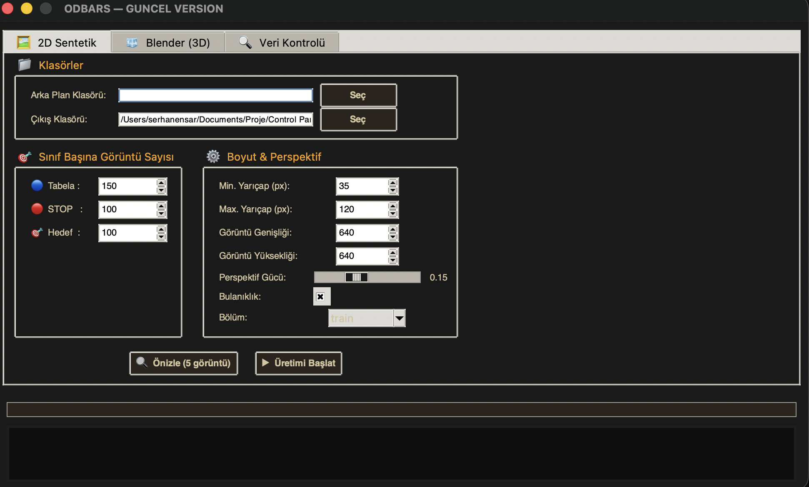
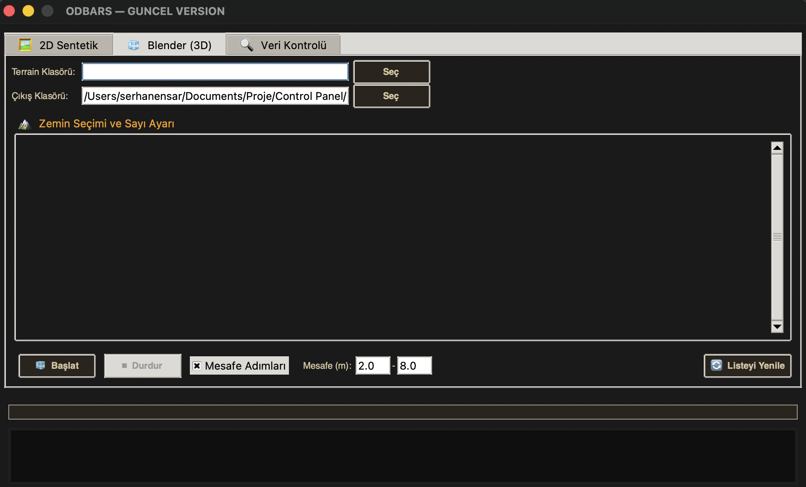
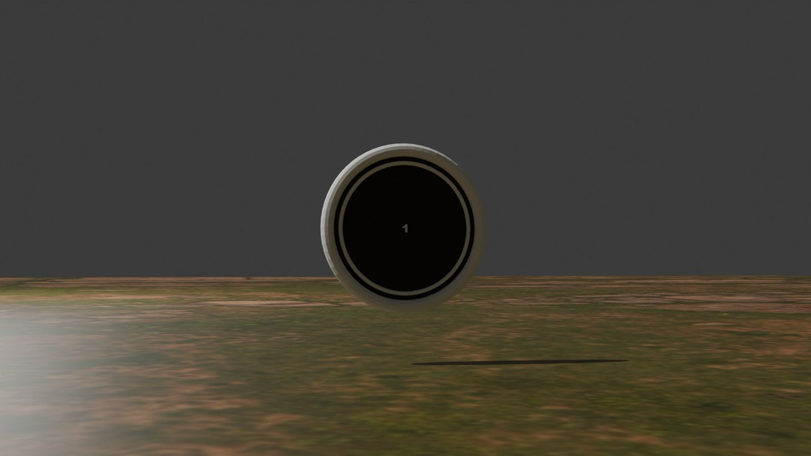
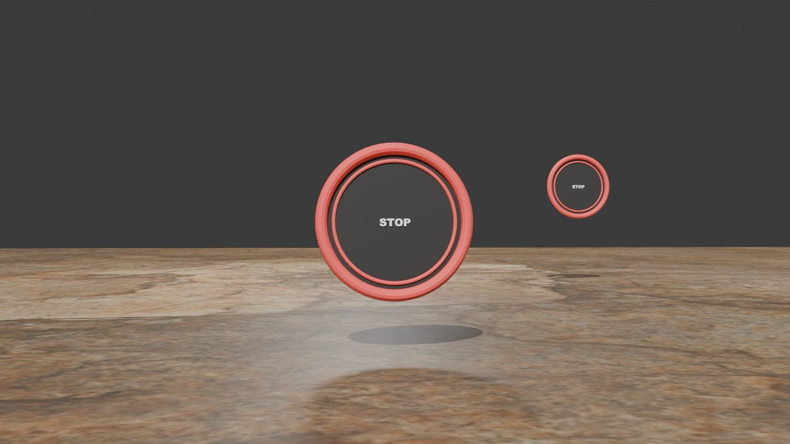

# 🎯 ODBARS Vision — Synthetic Data Generator

A synthetic training data pipeline for the **TEKNOFEST 2026 Unmanned Ground Vehicle (UGV)** competition. Generates YOLO-compatible annotated datasets using both a **2D procedural renderer** (OpenCV/PIL) and a **3D photorealistic Blender pipeline** — no real-world data collection required.

## 📸 Screenshots

### 🖥️ GUI Application

<table>
  <tr>
    <td></td>
    <td></td>
  </tr>
</table>

### 🖼️ Generated Data Samples

<table>
  <tr>
    <td></td>
    <td></td>
    <td></td>
  </tr>
</table>

## ✨ Features

- **Procedural 2D Generator** (`synth_gen.py`) — Generates annotated images of competition-specific objects on randomized terrain backgrounds
- **3D Blender Pipeline** (`blender_render.py`) — Photorealistic renders using Blender's Python API with displacement terrain, sign posts, and PBR materials
- **Interactive GUI** (`synth_gui.py`) — Full-featured desktop interface to configure, run, and preview both generation pipelines
- **Data Preparation** (`data_prep.py`) — Splits and validates dataset into train/val/test sets
- **YOLO-Ready Output** — All generated images come with normalized `.txt` label files in YOLO format

## 🎯 Object Classes

| Class ID | Object | Description |
|---|---|---|
| 0 | `tabela` | Course stage signs (Arial Black, 60cm diameter, black/white) |
| 1 | `stop` | STOP sign (circular, red border) |
| 2 | `hedef` | Shooting target (A3 size, concentric circles, Şekil 5) |

> Specs based on TEKNOFEST 2026 ODBARS UGV competition rulebook.

## 🛠 Tech Stack

| Component | Technology |
|---|---|
| 2D Generation | OpenCV, Pillow |
| 3D Rendering | Blender 4.x + Python API (`bpy`) |
| GUI | Tkinter |
| Label Format | YOLO v8/v11 (.txt normalized) |
| Training | Ultralytics YOLOv8 |

## 🚀 Getting Started

### Prerequisites

```bash
pip install -r requirements.txt
```

For 3D rendering, [Blender 4.x](https://www.blender.org/download/) must be installed and available in PATH.

### 2D Procedural Generation (CLI)

```bash
# Generate 200 training images
python synth_gen.py --n 200

# With custom backgrounds and preview
python synth_gen.py --n 500 --bg_dir backgrounds/ --preview

# Generate validation split
python synth_gen.py --n 50 --split val
```

Output is written to `dataset/images/train/` and `dataset/labels/train/`.

### 3D Blender Generation (CLI)

```bash
# Render 100 photorealistic images
blender --background --python blender_render.py -- --n 100

# With specific output directory
blender --background --python blender_render.py -- --n 100 --out dataset/
```

### GUI Application

```bash
python synth_gui.py
```

The GUI provides:
- Tabs for 2D and 3D generation modes
- Background folder selection
- Real-time dataset preview
- Blender process management (start/pause/stop)
- Output statistics

### Data Preparation

```bash
# Split existing dataset into train/val/test (80/10/10)
python data_prep.py
```

## 📁 Project Structure

```
ODBARS-Vision/
├── synth_gen.py        # 2D procedural generator + YOLO labeler
├── synth_gui.py        # Desktop GUI (Tkinter)
├── blender_render.py   # 3D Blender rendering pipeline
├── data_prep.py        # Dataset splitter & validator
├── dataset.yaml        # YOLO dataset configuration
├── requirements.txt    # Python dependencies
├── backgrounds/        # (user-provided) background images
└── dataset/            # Generated output (gitignored)
    ├── images/
    │   ├── train/
    │   └── val/
    └── labels/
        ├── train/
        └── val/
```

## 🔗 Related Projects

| Project | Description |
|---|---|
| [Odbars_Yazilim](https://github.com/SerhanEnsar/Odbars_Yazilim) | GCS Panel (React + Electron) for the ODBARS UGV |

## 📄 License

MIT
